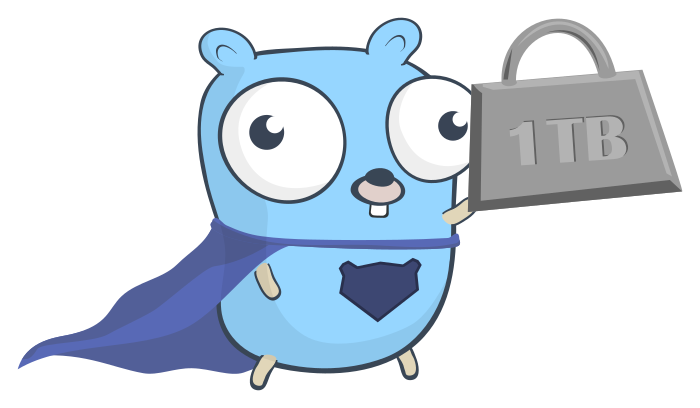
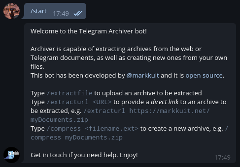
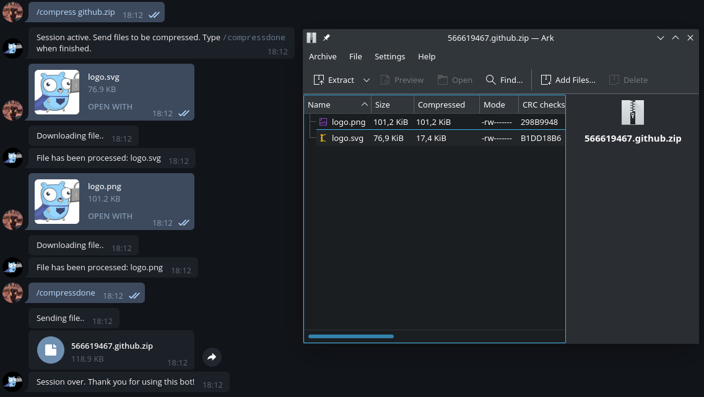
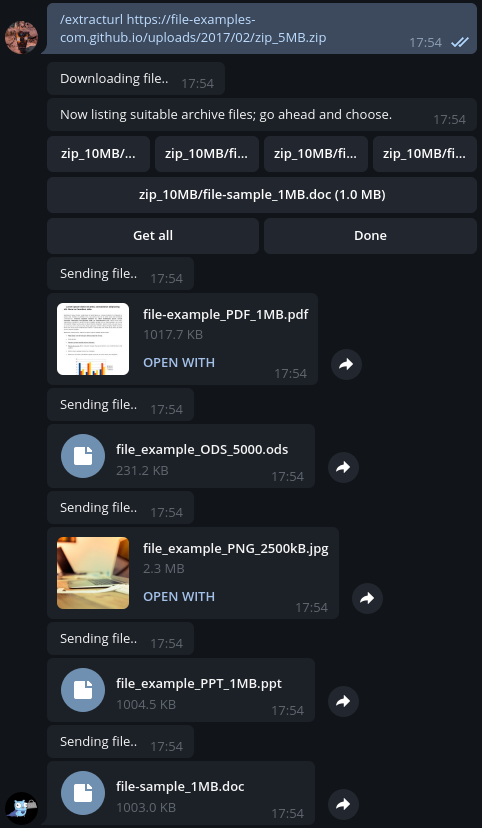
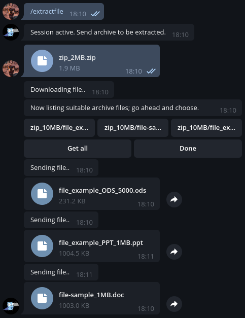

<p align="center"></p>

Archiver is a Telegram bot capable of extracting archives from the web or Telegram documents, as well as creating new ones from user provided files. You can find it at [@goarchiver_bot](https://t.me/goarchiver_bot).

### Screenshots

<p></p>
<p></p>

### Quick Start

The project includes quick start templates for running standalone, on Docker and on Heroku. The configuration can be provided via environment variables or the more convenient `.env`.

| Variable | Meaning |
| - | - |
| API_TOKEN | Telegram Bot API unique authentication token |
| MAX_CONTENT_LENGTH | Maximum content length for file downloads |
| MAX_EXTRACT_FILES | Maximum number of files to give out for bulk get requests |
| MAX_INLINE_BUTTONS | Maximum number of buttons for markup keyboards |
| MAX_SINGLE_FILE_SIZE | Maximum file size to be handled, both for downloads and uploads |
| INLINE_BUTTONS_ROW_SIZE | Maximum number of choice buttons to put in a single row in markup keyboards |
| TEMP_PATH | Temporary path for session files storage |

See also `.env.example`.

#### Standalone
```
$ mv .env.example .env
```
Edit `.env` accordingly.
```
$ make
```
#### Docker
```
$ mv .env.example .env
```
Edit `.env` accordingly.
```
$ docker-compose up -d
```

### Credits
The "Gopher lifting 1TB" is from [egonelbre/gophers](https://github.com/egonelbre/gophers).